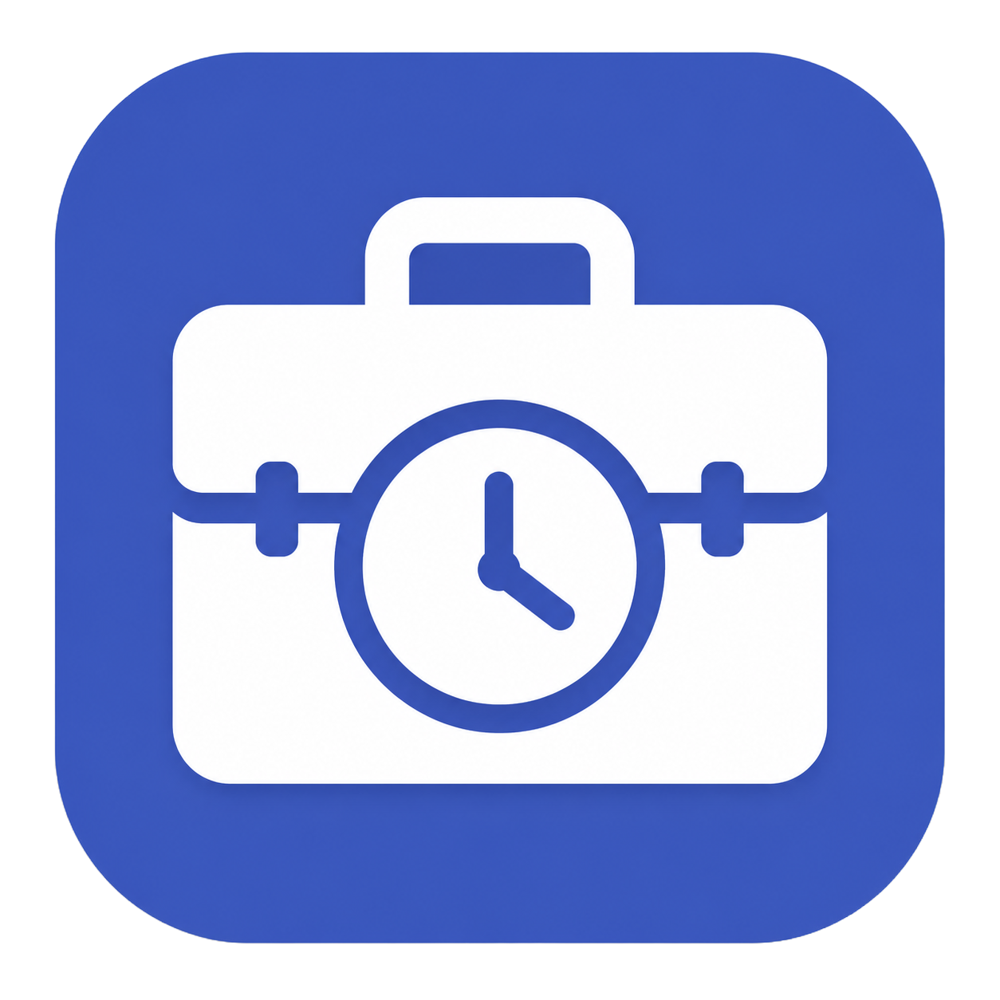
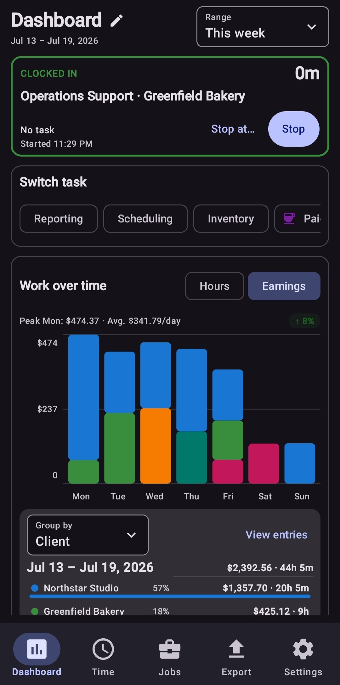
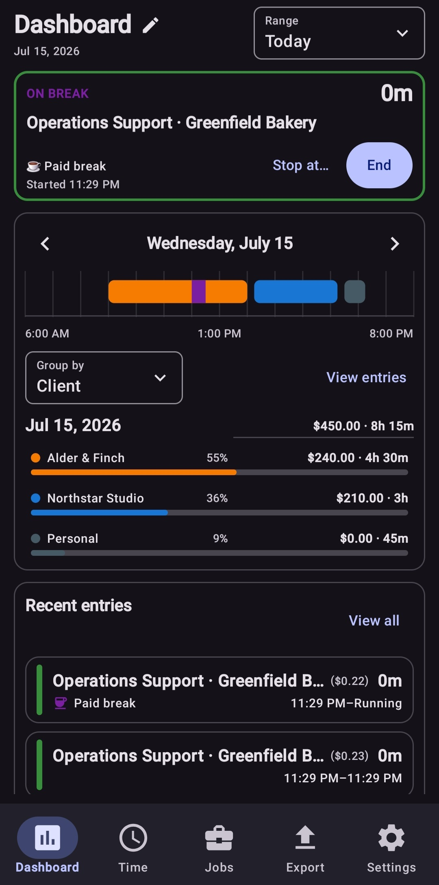
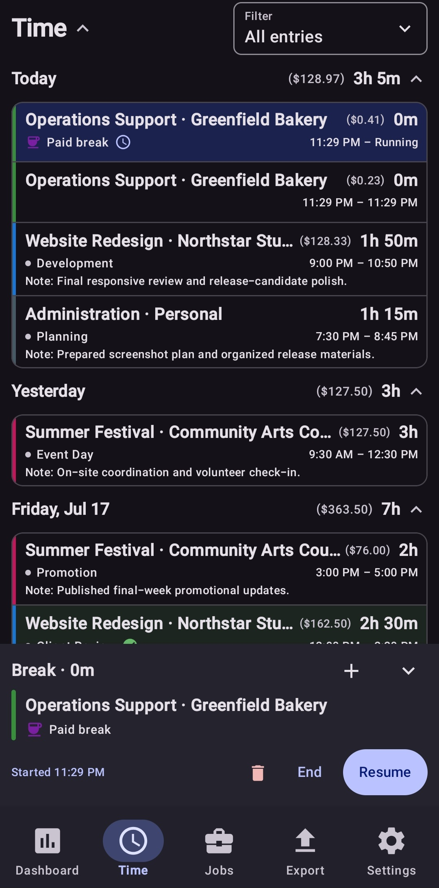
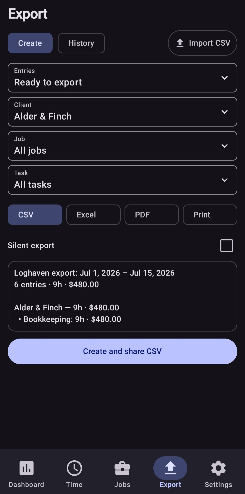

  

<h1 align="center">Loghaven</h1>

  Offline-first Android job and time tracking.

  
  
  
  

## Features

* Live job and task timers
* Paid and unpaid breaks
* Scheduled future stops
* Manual entries and editing
* Rates, earnings, and dashboard summaries
* CSV, XLSX, PDF, and print exports
* Encrypted and unencrypted backups
* Customizable dashboard widgets
* Notifications and reminders
* No account or internet connection required

## Install

Download the latest APK from the [Releases](../../releases) page.

For automatic update notifications, add this repository to [Obtainium](https://obtainium.imranr.dev/) and **enable prereleases**.

## Privacy

Loghaven stores its data locally on your device and does not request internet access.

Android cloud backup is disabled. Use Loghaven’s backup tools before reinstalling the app, resetting your device, or moving to another device.

## Support

Visit [micahjeffery.com/support](https://micahjeffery.com/support).

## Status

Loghaven is currently prerelease software. Back up important data before installing updates.

## Demo data

Fictional [demo data](demo/Loghaven-demo-screenshot-backup.json) is available for testing Loghaven.

**Warning:** Restoring a backup replaces the app’s current jobs, tasks, time entries, and export history.
