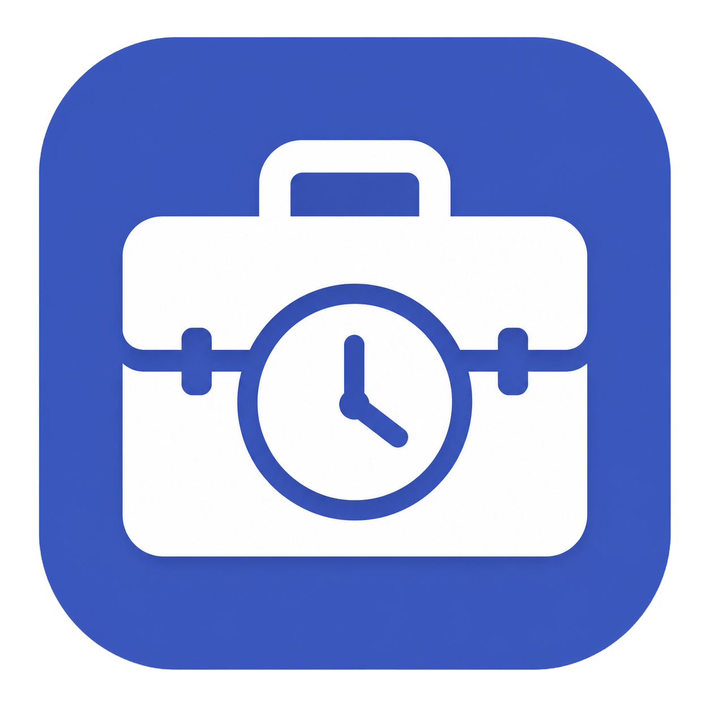
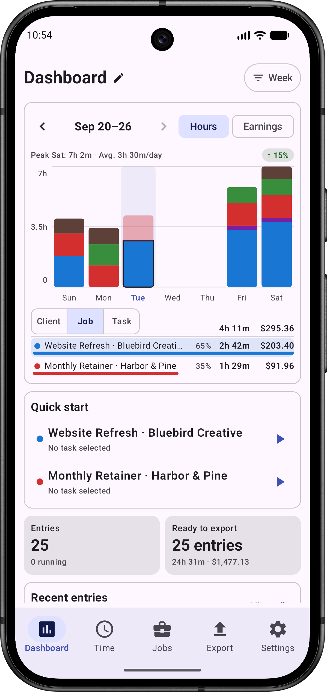
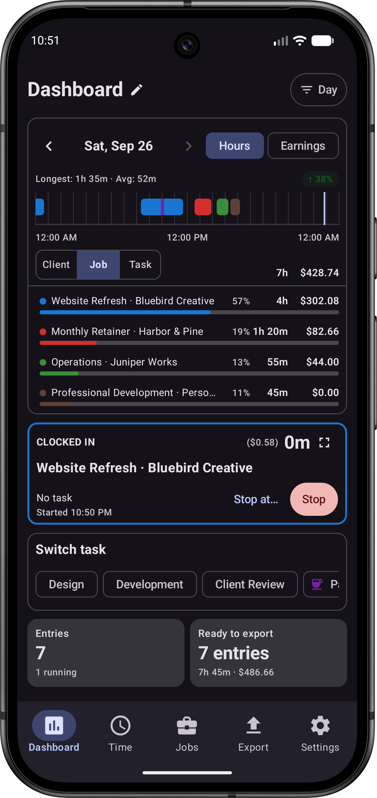
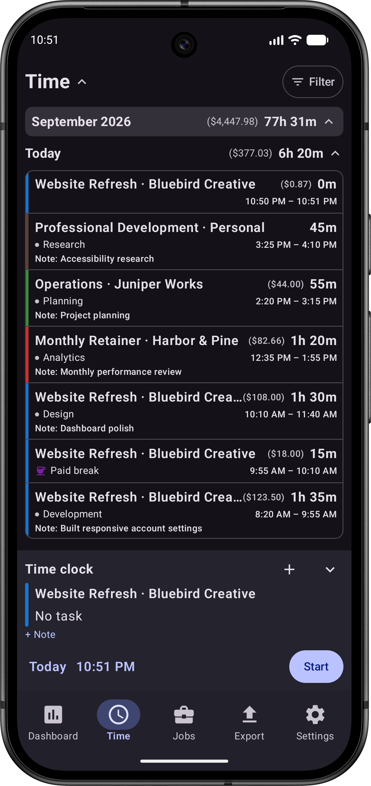
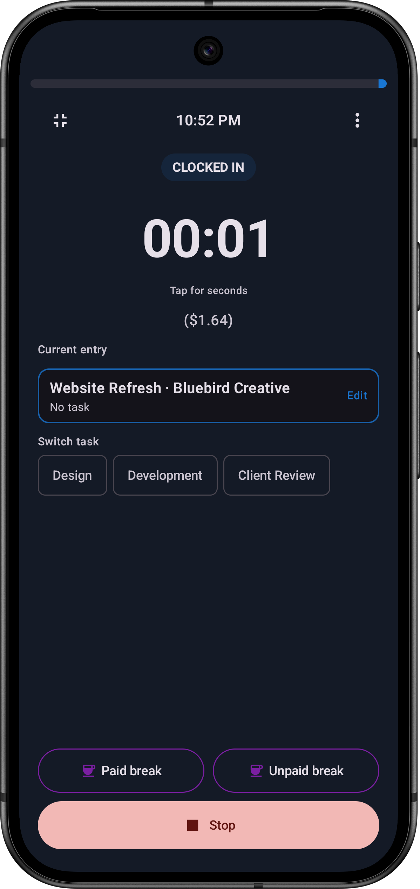

<h1 align="center">Loghaven</h1>

  

  Offline-first Android job and time tracking.

  
  
  
  

## Features

* Job and task timers with a fullscreen clock
* Paid and unpaid breaks
* Scheduled stops
* Manual entries and editing
* Rates, earnings, and dashboard summaries
* Day, week, month, and year charts, with daily bars in month view
* Customizable dashboard widgets
* Notifications at a set time or after session, daily, and weekly totals
* CSV, XLSX, PDF, and print exports
* Encrypted and unencrypted backups
* No account or internet connection required

## Install

Download the latest APK from the [Releases](https://github.com/micahjeffery/loghaven-releases/releases) page.

For updates through [Obtainium](https://obtainium.imranr.dev/), add this repository:

https://github.com/micahjeffery/loghaven-releases

Visit the [Loghaven website](https://loghaven.micahjeffery.com/) for more information and installation options.

## Privacy

Loghaven stores its data locally on your device and does not request internet access.

Android cloud backup is disabled. Use Loghaven's backup tools before reinstalling the app, resetting your device, or moving to another device.

## Support

Visit [micahjeffery.com/support](https://micahjeffery.com/support).

## Demo data

Fictional [demo data](demo/Loghaven-demo-screenshot-backup.json) is available for testing Loghaven.

**Warning:** Restoring a backup replaces the app's current jobs, tasks, time entries, export history, and backed-up settings. 
